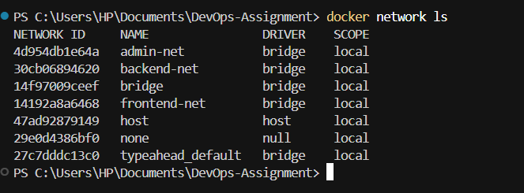
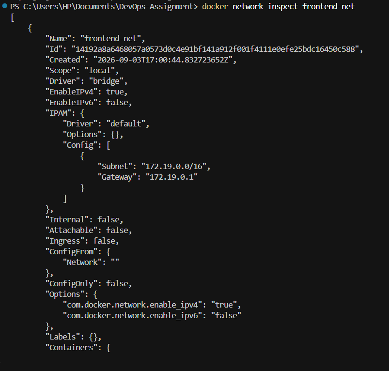
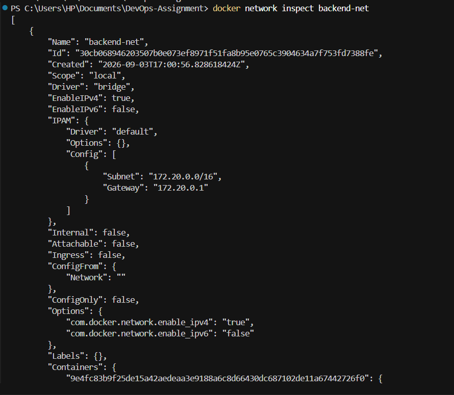
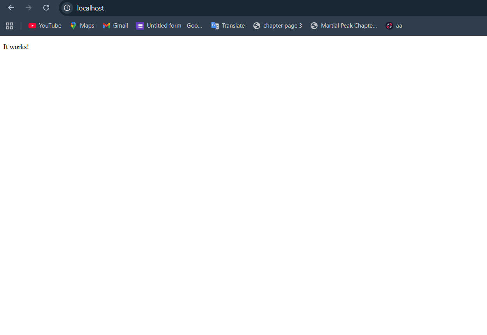
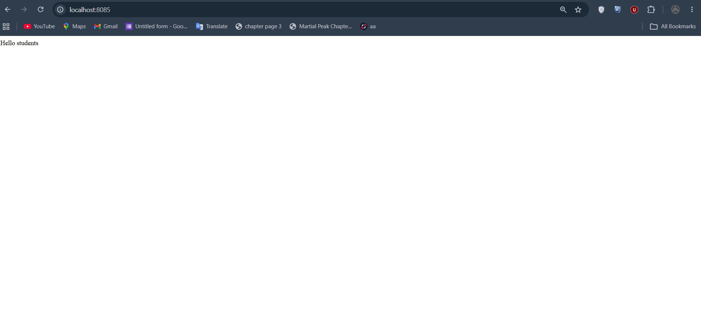
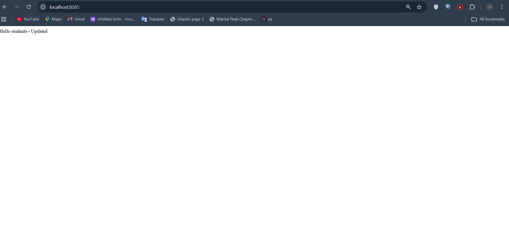
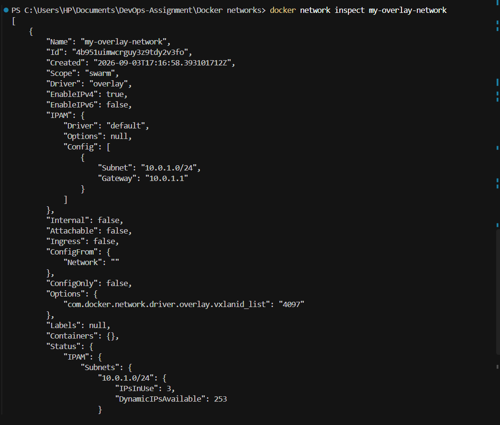

````markdown
# Docker Networking & Volume Homework

## Student Information

**Name:** YOUR NAME  
**Enrollment Number:** YOUR ENROLLMENT NUMBER

---

## Project Structure

```text
docker-networks/
├── bind-mount/
│   └── index.html
├── screenshots/
│   ├── networks.png
│   ├── containers.png
│   ├── frontend-network.png
│   ├── backend-network.png
│   ├── admin-network.png
│   ├── connectivity.png
│   ├── apache.png
│   ├── bind-mount.png
│   ├── bind-mount-updated.png
│   └── overlay-network.png
└── README.md
````

---

# Task 1: Docker Container Networking

## Objective

Create three Docker containers:

* Frontend
* Backend
* Database

Three different Docker networks were also created:

* `frontend-net`
* `backend-net`
* `admin-net`

The backend container was connected to two or more networks to allow communication between the frontend and database.

---

## Docker Images

| Container | Image  |
| --------- | ------ |
| Frontend  | Nginx  |
| Backend   | Alpine |
| Database  | MySQL  |

---

## Step 1: Pull Docker Images

```powershell
docker pull nginx
docker pull alpine
docker pull mysql
```

---

## Step 2: Create Three Docker Networks

```powershell
docker network create frontend-net
docker network create backend-net
docker network create admin-net
```

Verify the networks:

```powershell
docker network ls
```

### Screenshot



---

## Step 3: Create Database Container

```powershell
docker run -d `
  --name database `
  --network backend-net `
  -e MYSQL_ROOT_PASSWORD=root `
  -e MYSQL_DATABASE=testdb `
  mysql
```

---

## Step 4: Create Backend Container

```powershell
docker run -dit `
  --name backend `
  --network backend-net `
  alpine
```

---

## Step 5: Connect Backend to Additional Networks

Connect the backend to `frontend-net`:

```powershell
docker network connect frontend-net backend
```

Connect the backend to `admin-net`:

```powershell
docker network connect admin-net backend
```

The backend is now connected to:

```text
frontend-net
backend-net
admin-net
```

---

## Step 6: Create Frontend Container

```powershell
docker run -d `
  --name frontend `
  --network frontend-net `
  -p 8086:80 `
  nginx
```

---

## Network Architecture

```text
                    frontend-net
                 ┌─────────────────┐
                 │                 │
                 ▼                 ▼
            ┌──────────┐      ┌──────────┐
            │ frontend │      │ backend  │
            │  Nginx   │      │  Alpine  │
            └──────────┘      └────┬─────┘
                                   │
                         ┌─────────┴─────────┐
                         │                   │
                    backend-net          admin-net
                         │                   │
                         ▼                   │
                    ┌──────────┐             │
                    │ database │             │
                    │  MySQL   │             │
                    └──────────┘             │
                                             │
                                             └── backend
```

---

## Step 7: Inspect frontend-net

```powershell
docker network inspect frontend-net
```

The network contained:

```text
frontend
backend
```

### Screenshot



---

## Step 8: Inspect backend-net

```powershell
docker network inspect backend-net
```

The network contained:

```text
backend
database
```

### Screenshot



---

## Step 9: Inspect admin-net

```powershell
docker network inspect admin-net
```

The network contained:

```text
backend
```

## Step 10: Test Container Connectivity

Enter the backend container:

```powershell
docker exec -it backend sh
```

Install the ping utility:

```sh
apk add --no-cache iputils
```

Test connectivity to the database:

```sh
ping -c 4 database
```

Result:

```text
4 packets transmitted, 4 received, 0% packet loss
```

Test connectivity to the frontend:

```sh
ping -c 4 frontend
```

Result:

```text
4 packets transmitted, 4 received, 0% packet loss
```

Exit the container:

```sh
exit
```

This confirms that the backend can communicate with both the database and frontend.


## Running Containers

Verify the containers:

```powershell
docker ps
```

The following containers were running:

```text
frontend
backend
database
```


# Task 2: Host Network

## Objective

Pull the Apache2 image from Docker Hub and create an Apache container using host networking.

---

## Step 1: Pull Apache Image

```powershell
docker pull httpd
```

---

## Step 2: Create Apache Container Using Host Network

The Apache container was initially created using host networking:

```powershell
docker run -d `
  --name apache-host `
  --network host `
  httpd
```

Verify the container:

```powershell
docker ps
```

Apache logs confirmed that the server was running.

Apache was verified to be listening on port 80:

```powershell
docker exec apache-host sh -c "grep -n 'Listen' /usr/local/apache2/conf/httpd.conf"
```

Output:

```text
Listen 80
```

Apache configuration was also tested:

```powershell
docker exec apache-host httpd -t
```

Output:

```text
Syntax OK
```

---

## Docker Desktop on Windows

Docker Desktop on Windows handles host networking differently from native Linux Docker.

The Apache container was successfully created using:

```text
--network host
```

Apache was verified to be running and listening on port 80.

To make the Apache website accessible directly from the Windows browser, the container was subsequently run using port mapping:

```powershell
docker stop apache-host
docker rm apache-host
```

```powershell
docker run -d `
  --name apache-host `
  -p 80:80 `
  httpd
```

The Apache website was accessed at:

```text
http://localhost:80
```

The Apache webpage opened successfully.

### Screenshot



---

# Task 3: Bind Mount

## Objective

Create a local `index.html` file with the content `Hello students`, bind mount it into an Nginx container, and verify that changes are reflected without restarting the container.

---

## Step 1: Create index.html

The following file was created:

```text
bind-mount/index.html
```

Initial content:

```text
Hello students
```

Create the file using:

```powershell
Set-Content bind-mount\index.html "Hello students"
```

Verify:

```powershell
Get-Content bind-mount\index.html
```

Output:

```text
Hello students
```

---

## Step 2: Create Nginx Container with Bind Mount

```powershell
docker run -d `
  --name nginx-bind `
  -p 8085:80 `
  -v "${PWD}\bind-mount:/usr/share/nginx/html" `
  nginx
```

The local folder:

```text
bind-mount/
```

was mounted to:

```text
/usr/share/nginx/html
```

inside the Nginx container.

---

## Step 3: Access the Website

Open:

```text
http://localhost:8085
```

The website displayed:

```text
Hello students
```

### Screenshot



---

## Step 4: Modify index.html

The local HTML file was modified without restarting the Nginx container:

```powershell
Set-Content bind-mount\index.html "Hello students - Updated"
```

Verify:

```powershell
Get-Content bind-mount\index.html
```

Output:

```text
Hello students - Updated
```

---

## Step 5: Verify the Change

Refresh:

```text
http://localhost:8085
```

The updated content appeared:

```text
Hello students - Updated
```

The Nginx container was not restarted.

### Screenshot



---

## Step 6: Verify Inside the Container

```powershell
docker exec nginx-bind cat /usr/share/nginx/html/index.html
```

Output:

```text
Hello students - Updated
```

This confirms that the bind mount successfully connects the local file to the file inside the Nginx container.

---

# Task 4: Overlay Network

## Objective

Research Docker overlay networks and understand their use cases and how they work across multiple Docker hosts.

---

## Step 1: Initialize Docker Swarm

```powershell
docker swarm init
```

Docker Swarm was successfully initialized.

---

## Step 2: Create Overlay Network

```powershell
docker network create --driver overlay my-overlay-network
```

---

## Step 3: Inspect Overlay Network

```powershell
docker network inspect my-overlay-network
```

The output confirmed:

```text
"Scope": "swarm"
"Driver": "overlay"
```

This confirms that `my-overlay-network` is a Docker Swarm overlay network.

### Screenshot



---

## How Overlay Networks Work

Docker overlay networks allow Docker services running on different Docker hosts to communicate through a common virtual network.

They are commonly used with Docker Swarm.

A bridge network generally connects containers on the same Docker host, while an overlay network can span multiple Docker hosts.

Example:

```text
Docker Host 1                         Docker Host 2

┌─────────────────┐                  ┌─────────────────┐
│    Frontend     │                  │     Backend     │
│     Service     │                  │     Service     │
└────────┬────────┘                  └────────┬────────┘
         │                                    │
         └──────────────┬─────────────────────┘
                        │
                Overlay Network
                        │
                  Docker Swarm
```

---

## Use Cases of Overlay Networks

Overlay networks are useful for:

* Docker Swarm applications
* Microservices distributed across multiple hosts
* Communication between services on different Docker nodes
* Distributed containerized applications
* Service discovery across Swarm nodes

---

# Final Verification

Verify running containers:

```powershell
docker ps
```

Verify Docker networks:

```powershell
docker network ls
```

The completed setup included:

```text
Frontend       → Nginx
Backend        → Alpine
Database       → MySQL
Apache         → httpd
Bind Mount     → Nginx
Overlay        → Docker Swarm
```

---

# Port Summary

| Application      | Container Port | Host Port |
| ---------------- | -------------: | --------: |
| Frontend Nginx   |             80 |      8086 |
| Apache           |             80 |        80 |
| Bind Mount Nginx |             80 |      8085 |

---

# Project Structure

```text
docker-networks/
├── bind-mount/
│   └── index.html
├── screenshots/
│   ├── networks.png
│   ├── containers.png
│   ├── frontend-network.png
│   ├── backend-network.png
│   ├── admin-network.png
│   ├── connectivity.png
│   ├── apache.png
│   ├── bind-mount.png
│   ├── bind-mount-updated.png
│   └── overlay-network.png
└── README.md
```

---

# Conclusion

This assignment provided practical experience with Docker networking and storage.

The exercises demonstrated:

* Creating and managing Docker bridge networks
* Connecting containers to multiple networks
* Container-to-container communication
* Using host networking
* Running Apache HTTP Server
* Using Docker bind mounts
* Updating container content through a host-mounted file
* Creating Docker Swarm overlay networks
* Understanding communication across multiple Docker hosts

All four tasks were successfully completed and documented with screenshots.

```
```
