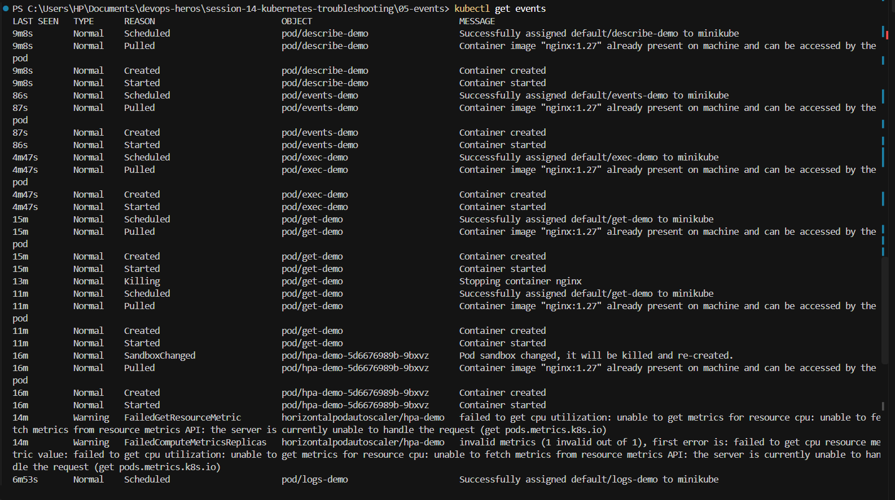
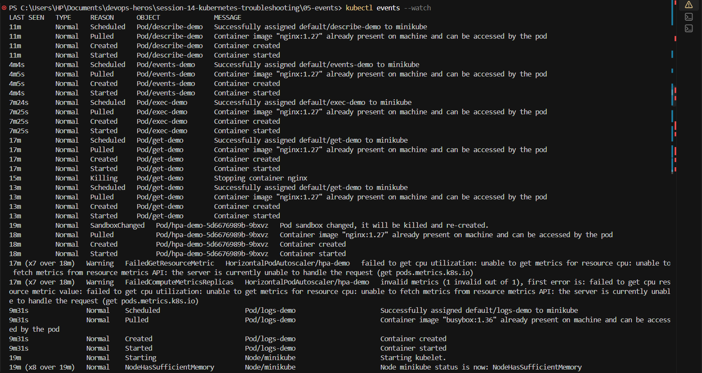
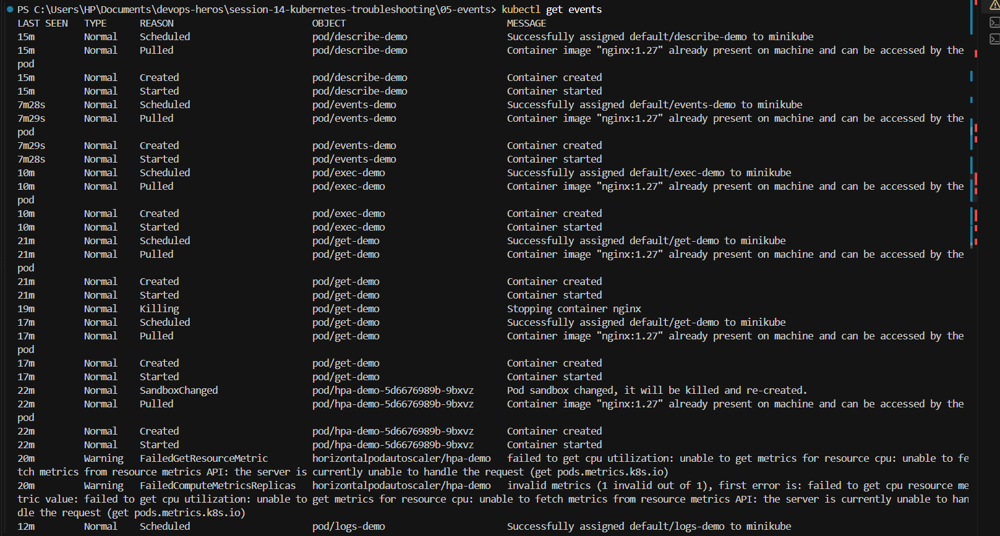
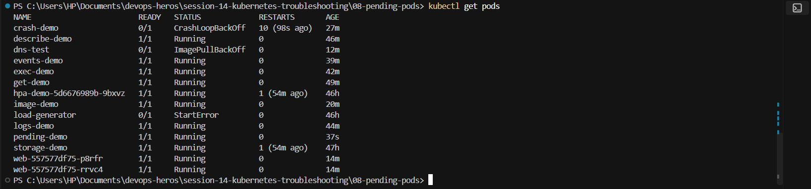
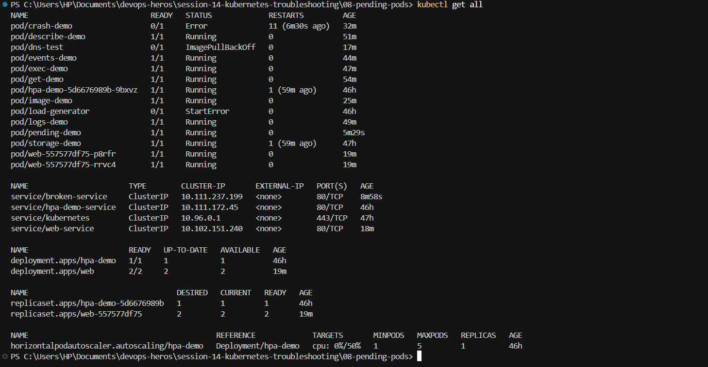
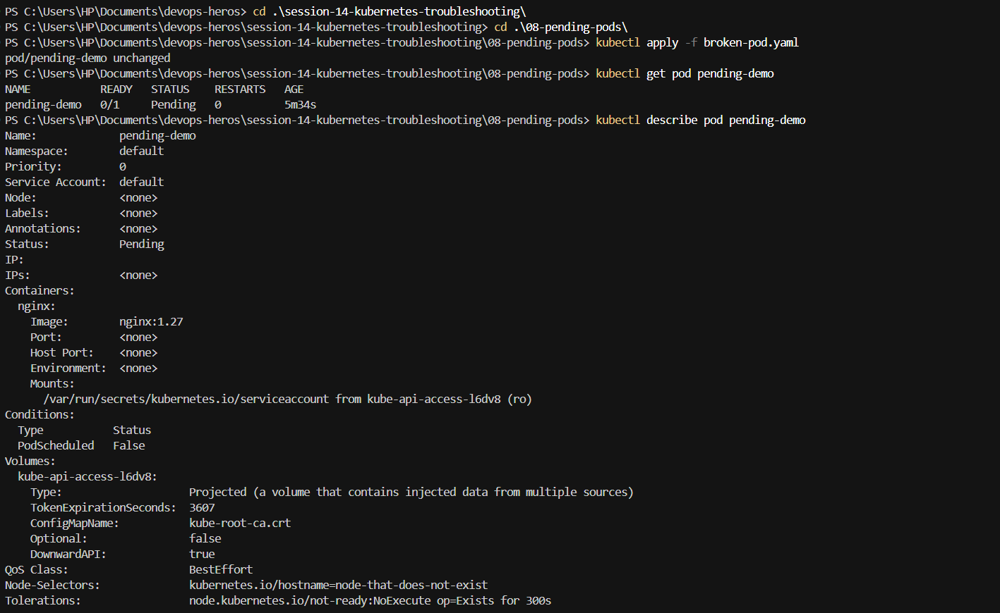
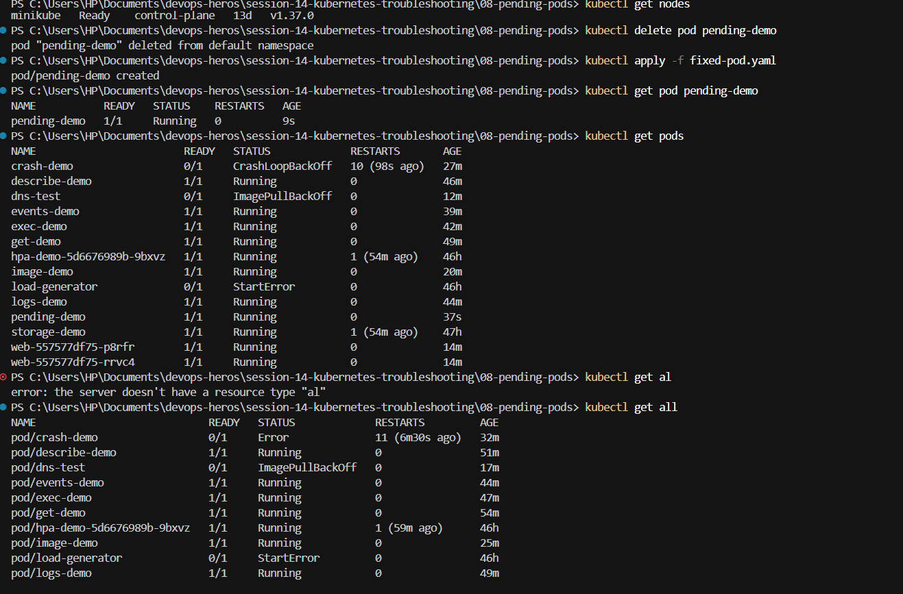
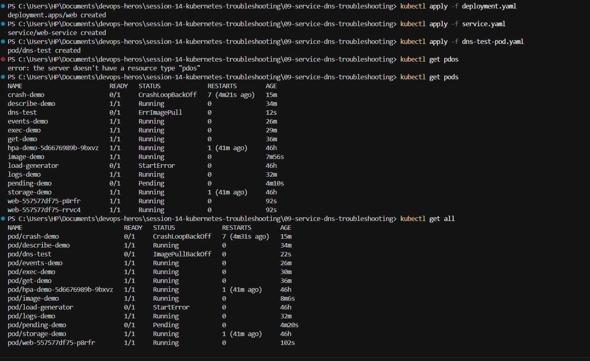
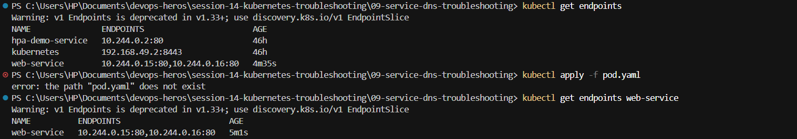
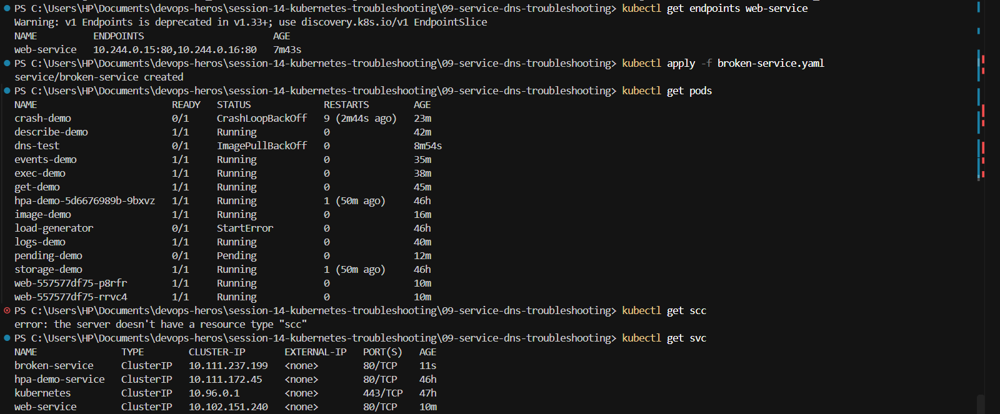

# Kubernetes Troubleshooting

This exercise demonstrates basic commands for checking pods, events, Services, and endpoints.

## Events and Logs

**Events** describe Kubernetes actions and state changes, such as scheduling a pod, pulling an image, starting a container, or reporting a warning. Use events to understand what happened to a resource.

**Logs** show the output produced by an application inside a container. Use logs to understand what the application itself is doing. Events and logs provide different information and are often used together.

## View Events

`kubectl get events` lists recent events in the namespace. Normal events such as `Scheduled`, `Pulled`, `Created`, and `Started` show successful pod startup. Warning events, such as the HPA metrics warnings shown below, indicate a problem that needs attention.



`kubectl events --watch` continuously displays new events as they occur.



Running `kubectl get events` again displays the current event list.



## Check Pods and Resources

`kubectl get pods` displays pod readiness, status, restart count, and age. The output shows healthy `Running` pods and problems such as `CrashLoopBackOff`, `ImagePullBackOff`, and `StartError`.



`kubectl get all` displays several resource types together, including pods, Services, deployments, ReplicaSets, and HPAs. This gives a quick overview of the namespace.



## Investigate a Pending Pod

The commands below create a pod, check its status, and show detailed information:

```powershell
kubectl apply -f broken-pod.yaml
kubectl get pod pending-demo
kubectl describe pod pending-demo
```

The output shows `Pending`, `Node: <none>`, and `PodScheduled: False`. The invalid node selector prevents Kubernetes from scheduling the pod.



The pod is corrected by deleting it and applying the fixed manifest. The new output shows `1/1 Running`.

```powershell
kubectl delete pod pending-demo
kubectl apply -f fixed-pod.yaml
kubectl get pod pending-demo
```



`kubectl get al` is an invalid command. The correct command is `kubectl get all`.

## Services and DNS

These commands create a deployment, a Service, and a DNS test pod:

```powershell
kubectl apply -f deployment.yaml
kubectl apply -f service.yaml
kubectl apply -f dns-test-pod.yaml
kubectl get pods
kubectl get all
```

The output shows the created resources and their pod statuses. `kubectl get pdos` fails because `pdos` is a typo; the correct command is `kubectl get pods`.



`kubectl get endpoints` shows the pod IP addresses connected to a Service. The two addresses listed for `web-service` confirm that the Service has available backend pods.



`kubectl get svc` lists Services. The screenshot also shows errors caused by invalid commands: `pod.yaml` does not exist in the directory, and `kubectl get scc` is not a valid resource command. Use `kubectl get svc` for Services.

