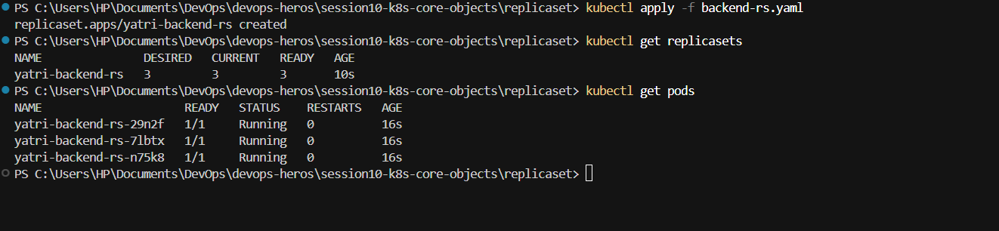
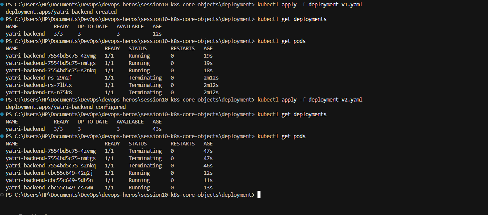
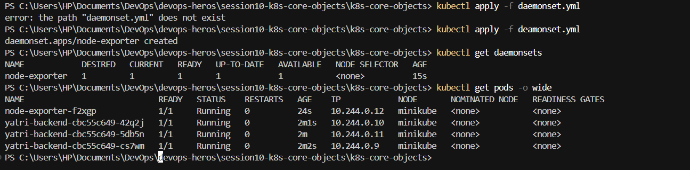
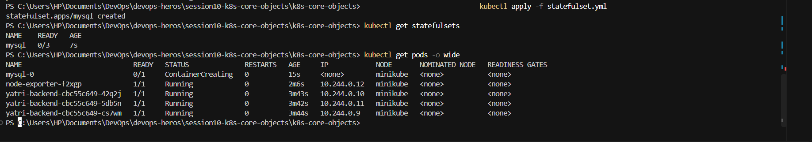

````markdown
# Kubernetes Workloads Assignment

This assignment covers the core Kubernetes workload controllers, their purposes, common use cases, and execution results.

---

## 1. ReplicaSet

### What is a ReplicaSet?

A **ReplicaSet** ensures that a specified number of identical Pod replicas are running at all times.

If a Pod fails, the ReplicaSet creates a replacement to maintain the desired number of replicas.

> ReplicaSets are usually managed by a **Deployment** rather than created directly.

### Execution



---

## 2. Deployment

### What is a Deployment?

A **Deployment** provides declarative management of Pods and ReplicaSets.

You define the desired state, such as:

```yaml
replicas: 3
````

The Deployment ensures that the required number of Pods are running.

### Key Features

* Declarative updates
* Rolling updates
* Rollbacks
* Scaling
* Controlled Pod replacement

### Execution



---

## 3. DaemonSet

### What is a DaemonSet?

A **DaemonSet** ensures that a copy of a specific Pod runs on every eligible worker node.

When a new node is added, Kubernetes automatically creates the Pod on that node.

### Common Use Cases

DaemonSets are commonly used for node-level services such as:

* **Log collection:** Fluentd, Logstash, Promtail
* **Node monitoring:** Prometheus Node Exporter, Datadog Agent
* **Storage services:** Ceph, GlusterFS

### Execution



---

## 4. StatefulSet

### What is a StatefulSet?

A **StatefulSet** manages stateful applications that require stable identities, persistent storage, or ordered deployment.

Unlike typical Deployment Pods, StatefulSet Pods have predictable identities such as:

```text
db-0
db-1
db-2
```

These identities remain associated with the Pods even when they are restarted or rescheduled.

### Key Features

* Stable Pod identities
* Stable network identities
* Persistent storage
* Ordered deployment and scaling
* Ordered updates

### Common Use Cases

* Databases such as MySQL and MongoDB
* Distributed databases such as Cassandra
* Message brokers such as Kafka and RabbitMQ
* Distributed systems such as ZooKeeper

### Execution



---

## 📚 Quick Comparison

| Workload        | Main Purpose                                         |
| --------------- | ---------------------------------------------------- |
| **ReplicaSet**  | Maintains a specified number of Pod replicas         |
| **Deployment**  | Manages stateless applications and updates           |
| **DaemonSet**   | Runs a Pod on each eligible node                     |
| **StatefulSet** | Manages stateful applications with stable identities |

```
```
